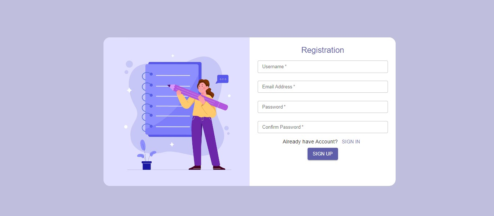
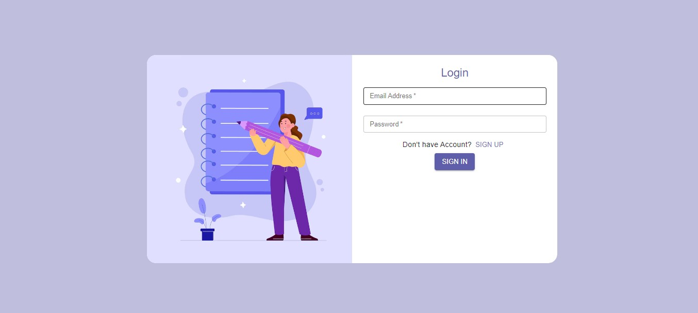
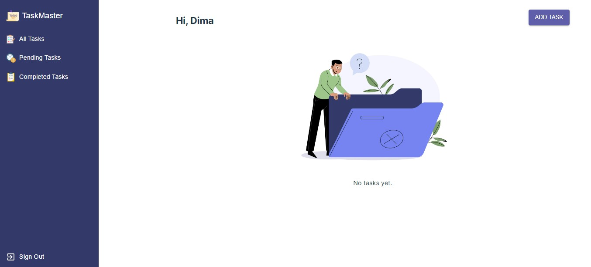
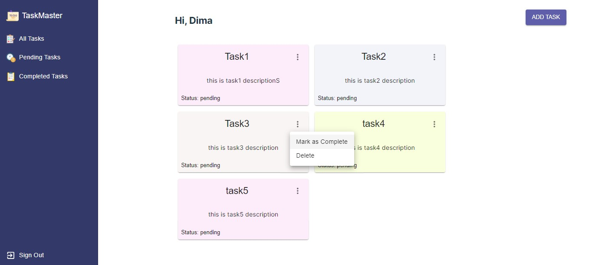
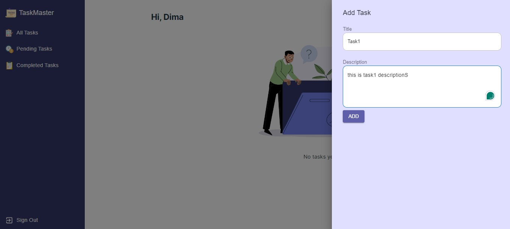

# React To-Do List Application with User Authentication

This is a React-based To-Do List application that allows users to manage their tasks with user authentication. Users can create an account, log in, and perform various actions such as adding, viewing, editing, and deleting tasks. The application also includes session management using cookies to keep users logged in when they revisit the application.

## Features

- User Registration: The application provides a user registration form that captures the username, email, and password of the user.

- User Login: Users can sign in using their email and password through a login form.

- Session Management: The application utilizes session management to keep users logged in when they revisit the application. This is achieved through the use of cookies.

- User-specific Tasks: Tasks are user-specific, meaning each user can only access and manage their own tasks.

- Task Management: Authenticated users can add new tasks, view their existing tasks, edit the status of tasks (completed/pending), and delete tasks.

- Task Status and Filtering: Users can mark tasks as completed or pending. The application provides the ability to filter tasks based on their status, allowing users to view all tasks, completed tasks, or pending tasks.

- Redux Toolkit: The application utilizes Redux Toolkit for more complex state management, particularly for handling authentication states and task data across multiple components.

- MUI Components: The application uses MUI (Material-UI) components for a consistent and visually appealing user interface.

- Responsive Design: The application is responsive and provides a seamless experience across various device sizes.

- Input Validation: Registration and login forms include input validation to ensure data integrity and provide a smooth user experience.

- Error Handling: The application includes manual validation, error404 page, error boundary, and error500 page to handle errors gracefully.

- Fake API: The application uses json-server as a fake API to simulate backend functionality during development.

## Packages Used

The following packages were used in this project:

- json-server: Simulates a fake API to provide backend functionality during development. [Link to json-server](https://www.npmjs.com/package/json-server)

- react-cookie: Enables session management and handling of cookies for user authentication. [Link to react-cookie](https://www.npmjs.com/package/react-cookie)

- react-error-boundary: Provides error boundary components to catch and handle errors in the application. [Link to react-error-boundary](https://www.npmjs.com/package/react-error-boundary)

- react-responsive: A utility library for building responsive UI components. [Link to react-responsive](https://www.npmjs.com/package/react-responsive)

## Screenshots






## Getting Started

To run the application locally, follow these steps:

1. Clone the repository:

   ```bash
   https://github.com/DimaMarji/React-To-Do-List.git
   ```

2. Install dependencies:

   ```bash
   npm install
   ```

3. Start the server and the JSON server:

   ```bash
   # Start the server
   npm run dev

   # Start the JSON server
   npm run json-server
   ```

4. Open the application in your browser:

   ```bash
   http://127.0.0.1:5173/
   ```

   the json server should opens on

    ```bash
   http://localhost:4000
   ```

## Acknowledgements

- This application was developed using React and Redux Toolkit.
- MUI components were used for the user interface.
- The json-server library was used to simulate a fake API.